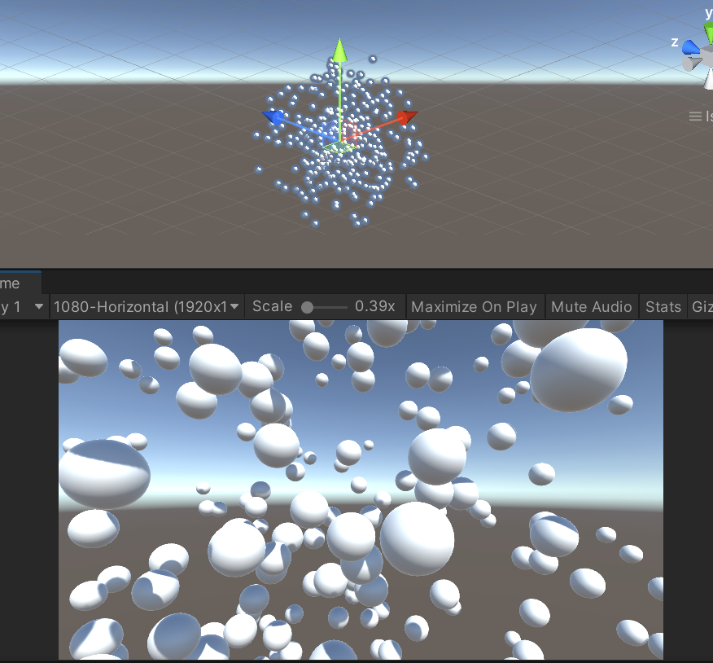

# UnityComputeShaders

Resources from my Udemy course on ComputeShader plus personal experiment around that.

## Scene reference

Spheres

## Reference

[ComputeShader on Udemy](https://www.udemy.com/course/compute-shaders/)  
[Shader Rendering in Unity](https://www.udemy.com/course/unity-shader-development/)  
[bresenhams rasterising circle](https://www.geeksforgeeks.org/bresenhams-circle-drawing-algorithm/)  
[Arsiliath Tutorial 1](https://www.youtube.com/watch?v=V-yqiLyU27U)  
[Arsiliath Tutorial Grid Cellular Automata](https://www.youtube.com/watch?v=9ZvApdR6m-c)  
[AMD presentation](https://www.youtube.com/watch?v=0DLOJPSxJEg)  
[Compute Shader 101](https://www.youtube.com/watch?v=DZRn_jNZjbw)  
[Coding Adventure: Compute Shaders](https://www.youtube.com/watch?v=9RHGLZLUuwc)  
[Coding Adventure: Compute Shaders](https://github.com/SebLague/Hydraulic-Erosion)  
[Softology Cellular Automata](https://softologyblog.wordpress.com/2021/02/14/even-more-explorations-with-multiple-neighborhoods-cellular-automata/)  
[Softology 4D Cellular Automata](https://softologyblog.wordpress.com/2017/12/15/4d-cellular-automata/)  
[Sebastian Lange Compute Shader](https://github.com/SebLague/Hydraulic-Erosion)  
